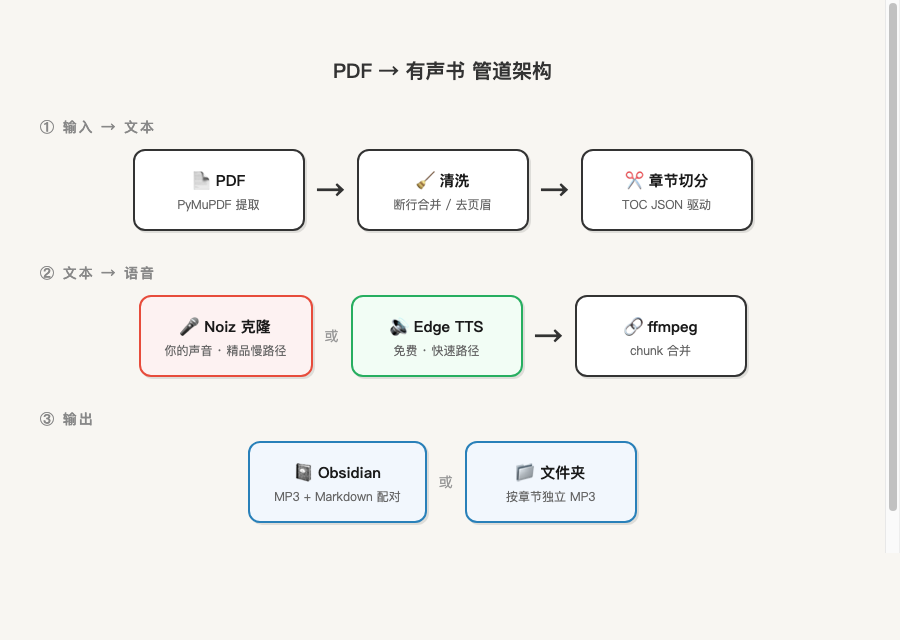
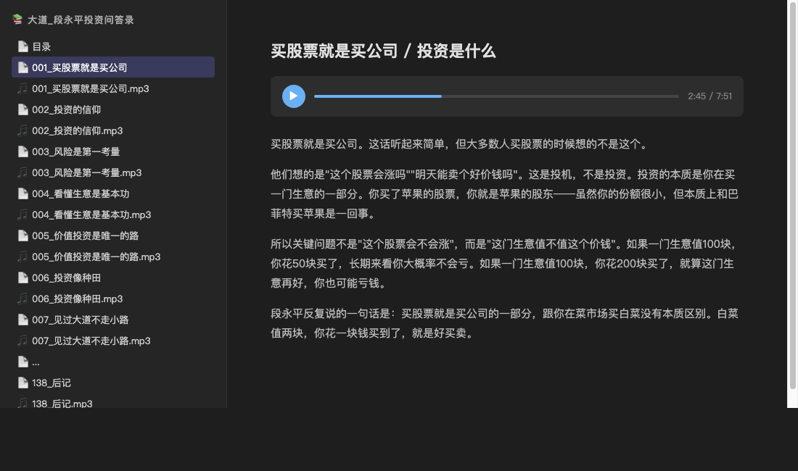
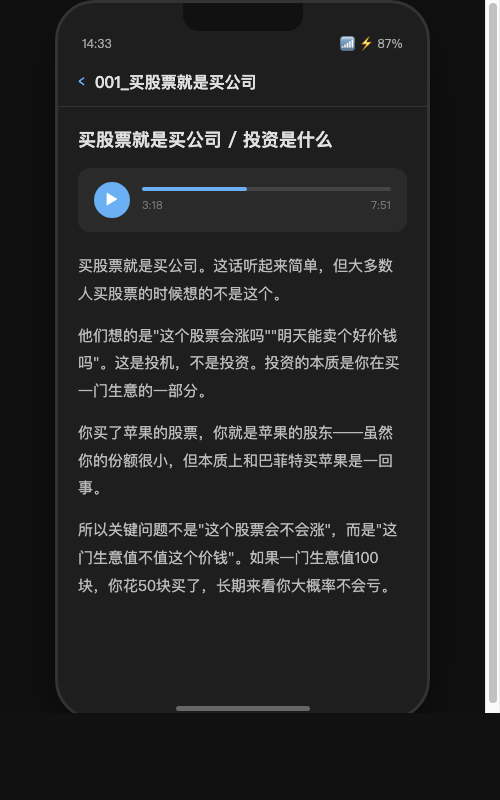

## 一、一本反复读的书

段永平的《大道：投资问答录》，509页，33万字。我断断续续读了几遍，两个月。

偶尔复读拿起来读三页，女儿喊我，放下。第二天翻开，忘了看到哪。

那天下午去接女儿放学，把电子版放到了微信读书里听了半天，这个声音不得劲。

半路突然想到一件事：能不能用一个我喜欢的声音，把这本书在我开车或者不想看的时候读给我听？

不是去一个APP用默认的播音员版本——是**我指定的声音**，读**我指定的内容**。开车听，做饭听，带孩子去公园时挂个耳机听。阅读的瓶颈不是眼睛，是场景。耳朵能到达眼睛去不了的地方。

回到家我就开始干了。

## 二、方案评估：Openclaw找合适的Skill搭配

我的 Mac mini 上跑着 [OpenClaw](https://github.com/openclaw/openclaw)——一个开源的 AI Agent 框架，24小时在线，通过飞书对话。它有一套 skill（技能）机制，社区在 [ClawHub](https://clawhub.com) 上共享各种 skill，我先去找了一圈现成方案。

**找了一圈，评估了这些方案：**

- **audiobook-generator**（ClawHub skill）：依赖 SenseAudio 的 API key，需要单独申请。
- **audiobooklm**（ClawHub skill）：它的 `synthesize_tts` 函数有 **200 字的硬限制**——一本33万字的书，按200字一段切？那不是有声书，是碎片轰炸。
- **OpenAI TTS**：音质好，情绪表达强，但按字符计费，33万字中文跑下来成本不低，而且没有声音克隆能力——只能从 OpenAI 提供的几个固定音色里选。
- **ElevenLabs**：支持声音克隆，效果一流，但定价按字符数阶梯收费，长篇幅成本高。更重要的是它对中文的支持一般，英文场景更合适。
- **Edge TTS**：微软免费，中文音色多，速度快——但没有声音克隆。适合做快速路径，不适合做最终品质版。

都不能干净地完成"PDF → 完整逐字朗读 → 按章节输出"这件事。

**结论：自己写一个 skill。**

整条管道的架构长这样：



## 三、技术选型：两个引擎，各有用处

语音合成引擎是核心决策。我测了两个：

### Edge TTS（免费，微软）

- 中文音色十几种，默认用 `zh-CN-XiaoxiaoNeural`（女声）
- 合成速度快，33万字几十分钟跑完
- 质量中规中矩——字正腔圆，但没感情，像 AI 在读新闻稿
- **零成本，零 API key**，`pip install edge-tts` 直接用

### Noiz（克隆声音）

- 上传几分钟录音，平台返回一个 voice_id
- 给它任何文本，返回**你自己的声音**
- 每 500 字一次 API 调用，每次约 50-80 秒返回
- 全书33万字 ≈ 633 次 API 调用 ≈ **10-12 小时**
- API key 存在1PASSWORD，调用安全

**最终决定两个都留。** Edge 做快速调试和试听，Noiz 做正式版。skill 里加了 `--engine` 参数，一句话切换你想要的结果。


Edge 是快路径，Noiz 是精品慢路径。两条路径的定位从一开始就很清楚。

## 四、PDF 文本提取：比想象中脏

一本 PDF 对计算机来说就是一堆带格式的字节。用 PyMuPDF（pymupdf 1.27.2）逐页提取纯文本，509 页提出 331,777 个字。

但提取出来的文本**根本不能直接用**。PDF 的排版会制造大量噪音：

### 坑一：断行

原文中"极小"这个词，在 PDF 排版中恰好被分在两行：

```
极
小
```

提取出来就是 `"极\n小"`。语音引擎会老老实实在两个字之间停顿——听起来像结巴。"偶然性"变成了"偶\n然性"，"极小"变成了"极……小"。

**修复方案：用AI去做文字的校对核验，重新梳理不规则原文的排版和阅读体验。

这个 bug 如果不是自己真的去听了生成的音频，可能永远不会发现。

### 坑二：页眉页脚版权页和目录页混入正文

每页顶部的书名、页码会被提取成正文的一部分。前 11 页是出版信息，12-20 页是目录，22 页才是"第一章 投资大道"。如果不跳过，语音引擎会认真朗读出版社地址和 ISBN 号——没人想听这个。
，清洗阶段统一去除。

### 坑三：打印不清楚

有些个别字错乱或者不清晰的地方OCR识别加全网搜索智能补全。

## 五、章节切分：最折腾的部分

33万字不能一口气扔给语音引擎。要按目录章节切分，每章生成一个独立的 MP3。

### 第一版：正则匹配（失败）

最初用正则识别章节标题——"第X章"、"第X节"之类。

问题一大堆：
- 《大道》的章节结构不规整，有的用"第一章"，有的用"1."，有的就是加粗标题
- `^\d{1,3}[\.、]\s*\S` 这种宽正则会把"1. 基本版 / 2. 说明版"之类的列表项误判为章节
- PDF 提取偶尔丢字——"第二章 商业模式和企业文化"被提取成了"第 章 商业模式和企业文化"，中间的"二"不见了，正则直接匹配失败

只靠正则，最终只识别出 5 个大章节，而且第二章完全缺失。

### 第二版：TOC JSON 驱动（可用）

换了思路：不依赖正则猜章节，而是**直接从目录页提取真实目录结构**。

这本书有 9 页目录（12-20 页），提取后整理成 JSON：

```json
[
  "第一章 投资大道",
  "买股票就是买公司",
  "估值就是毛估估",
  ...
]
```

177 个目录标题。然后拿这些标题去正文里定位起止位置。

**又踩一个坑：** 有些标题在正文中重复出现（比如某个短语既是目录标题又在后文被引用），导致匹配位置提前。正确的方案应该是"匹配时受章节/页范围约束"——这个还没完全实现，但当前效果已经够用。

最终稳定切出 **138 个 section**，总计 316,847 字，每段 1,000-15,000 字不等。

### 超大章节处理

有的章节特别长（第一章约 14.5 万字），直接给语音引擎也不行。`detect_chapters` 加了自动细分逻辑：超过设定字数的章节按固定长度再切，合成完再用 ffmpeg 拼回完整章节。

## 六、语音合成 + 音频合并

每个 section 被切成更小的 TTS chunk（Edge 按段落切，Noiz 按 500 字切），逐块调用语音引擎生成音频片段，然后用 **ffmpeg concat** 协议拼回完整章节。

现行方案是 ffmpeg merge。

ffmpeg 合并的命令大概长这样：

```bash
ffmpeg -f concat -safe 0 -i filelist.txt -c copy output.mp3
```

简单、稳定、不依赖 Python 音频库。

## 七、Obsidian 输出：边听边看

不是扔一堆 MP3 在桌面上就完事。加了 `--obsidian` 参数后，每个章节输出两个文件：

```
有声书/大道_段永平投资问答录/
├── 目录.md
├── 001_投资大道.md      ← 音频播放器 + 原文
├── 001_投资大道.mp3
├── 002_买股票就是买公司.md
├── 002_买股票就是买公司.mp3
├── ...
├── 138_后记.md
└── 138_后记.mp3
```

每个 `.md` 文件里，顶部嵌入音频播放器（Obsidian 支持 `![[file.mp3]]` 语法），下面是完整原文。点开一章，上面播放，下面看文字，**边听边看**。

因为我的 Obsidian vault 放在 iCloud 上，Mac mini 生成的文件会自动同步到所有设备。也就是说，电脑上跑完命令，手机上打开 Obsidian 就能直接听——138 个章节的音频和原文已经在那了，不需要手动拷贝、不需要传文件。一句命令跑完，手机直接出结果。

Obsidian 移动端完整支持音频播放，点开一章就能边听边看。所有内容在本地，没有平台锁定，没有会员到期。





## 八、实际运行数据

最终正式跑的命令：

```bash
python3 pdf_to_audiobook.py \
  --pdf "大道_段永平投资问答录.pdf" \
  --engine noiz \
  --voice b04f960f \
  --start-page 22 \
  --toc /tmp/dadao_toc.json \
  --obsidian \
  --output ~/Obsidian/米来/有声书/大道_段永平投资问答录/
```

**运行数据：**

| 指标 | 数据 |
|------|------|
| 源 PDF | 509 页，331,777 字 |
| 正文范围 | 第 22 页起 |
| TOC 标题数 | 177 个 |
| 切出 section 数 | 138 个 |
| 预估 Noiz API 调用次数 | ~633 次 |
| 单次 API 耗时 | 41-85 秒，平均约 55 秒 |
| 预估总耗时 | 10-12 小时 |
| 第一个 section（14,379 字） | 8 个 TTS chunk → 约 25 分钟音频 |
| 输出 | 138 个 MP3 + 138 个 MD + 1 个目录页 |

### 断点续跑

skill 支持跳过已生成的章节。如果中途断了（网络、机器休眠、API 连续失败），重跑同一命令会自动从断点继续。这对 10+ 小时的长任务很关键。

### Noiz API 的实际表现

- 偶有 503，但自动重试后恢复
- 500 字以内的 chunk 最稳定
- Python requests 比 curl 更可靠（curl 对长 JSON payload 容易卡住）
- **不适合做默认批量引擎**——适合"精品慢产"

## 九、不只是一本书

管道搭好之后，输入端不一定是 PDF。

任何能变成文本的东西都能进这条管道：公众号长文、YouTube 字幕、研究报告、epub 电子书、会议纪要。形式不同，最终都归约成纯文本，进管道，出来就是指定声音的音频。

声音也不一定是你的。Noiz 的克隆不限于自己——任何人上传几分钟录音都能生成专属声音模型。

**三个变量完全自由：**

**用谁的声音。** 你自己的、你伴侣的、你导师的、你喜欢的播客主播的。

**读什么内容。** 一本冷门投资书、一份你关心的行业报告、孩子学校的课外读物、你自己写的笔记。

**在哪里听。** 开车、跑步、做饭、睡前、地铁上。

组合出来的东西远超"有声书"三个字能装的——

出差的妈妈录几分钟声音，以后想给孩子讲的故事扔进去，出来的是妈妈的声音。妈妈不在的晚上，声音在。

老师把讲义变成自己声音的音频，学生复习时听到的是课堂上那个熟悉的声音。

一个人深夜想听到某个不在身边的人的声音读一段话。

这些场景没有一个是"有声书行业"会去服务的——太个人、太零散、太不标准化。出版社不可能为每个妈妈单独录一版。

但一条本地管道可以。边际成本几乎是零。

## 十、真正重要的不是管道

从"我想用自己的声音读那本书"到管道跑通，大约十分钟。

评估方案是 agent 做的。写 Python 脚本是 agent 做的。调 ffmpeg 参数是 agent 做的。排查断行 bug 是 agent 做的。这些事情每一件都需要专业能力——但这些能力现在不稀缺了。

真正需要我参与的，就一件事：**那个开车时冒出来的念头。**

AI 时代，执行力正在被拉平。以前做一本有声书需要出版社立项、播音员进棚、后期剪辑、平台审核上架，成本结构决定了只有头部内容值得做。现在一个人、一台电脑、一个想法，能撬动以前需要一个团队的产出。

但 AI 不会在你开车接孩子的路上冒出"我想用自己的声音读那本书"这个念头。不会在洗澡时想到两个不相关的事情之间的联系。不会因为对某件事不爽而产生"我要把这个搞定"的冲动。

工具越强大，方向感越值钱。**想法是唯一不会被拉平的东西。**

## 十一、自建 Skill

`pdf-to-audiobook` 能力小测试

**支持的功能：**

- 双引擎：Edge TTS（免费）/ Noiz（克隆声音）
- PDF 全文逐字提取，自动清洗排版噪音
- TOC JSON 驱动的章节切分
- `--start-page` / `--end-page` 跳过非正文页
- `--obsidian` 输出音频+原文配对的 Markdown
- 断点续跑
- `--list-voices` 查看 Edge TTS 可用音色

**依赖：**

```bash
pip install edge-tts pymupdf
# ffmpeg 需要预装（macOS: brew install ffmpeg）
# Noiz 引擎需要 API key（~/.noiz_api_key）
```

跟你的 OpenClaw agent 说一句"帮我把这本 PDF 做成有声书"，它会调这个 skill 完成剩下的事。

---

*写这篇文章的时候，138 个章节的音频还在 Mac mini 上安静地跑着。明天开车接女儿，我会从第一章开始听段永平谈投资——用我自己的声音。*

---

## 用你想用的声音，听你想听的内容

写完这些，回过头看，这件事真正打动我的不是技术实现——而是一种可能性被打开了。

以前"听什么"这件事，选择权不在你手上。平台有什么你听什么，播音员是谁你没得挑，哪本书值得做成有声版由出版社的商业判断决定。你想听的那本冷门书、那份只对你有意义的报告、那篇你反复读的文章——没有人会为你单独录一版。

现在这个限制不存在了。

你想用谁的声音，就用谁的声音。你想听什么内容，就把什么内容扔进去。不需要等平台上架，不需要等人录制，不需要付订阅费，不需要任何人的许可。

想象一下——

你最喜欢的那个播客主播，用 TA 的声音给你读你书架上积灰的那本书。每天通勤路上听半小时，一个月啃完一本一直没时间读的大部头。

你自己的声音，给未来的孩子讲你现在的故事。不是录音笔里断断续续的片段，而是完整的、一章一章的、可以反复听的东西。

一个已经不在的人的声音，读一段新写的文字。技术上这已经完全可行，几分钟的音频样本就够。

这不是科幻。这是一台电脑、一个想法、一条管道就能做到的事。

**用你想用的声音，听你想听的内容。** 这件事从今天起，只取决于你自己。
