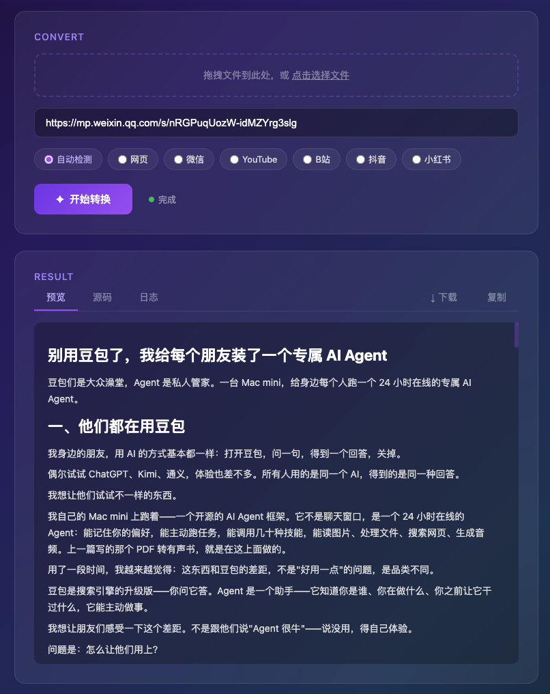
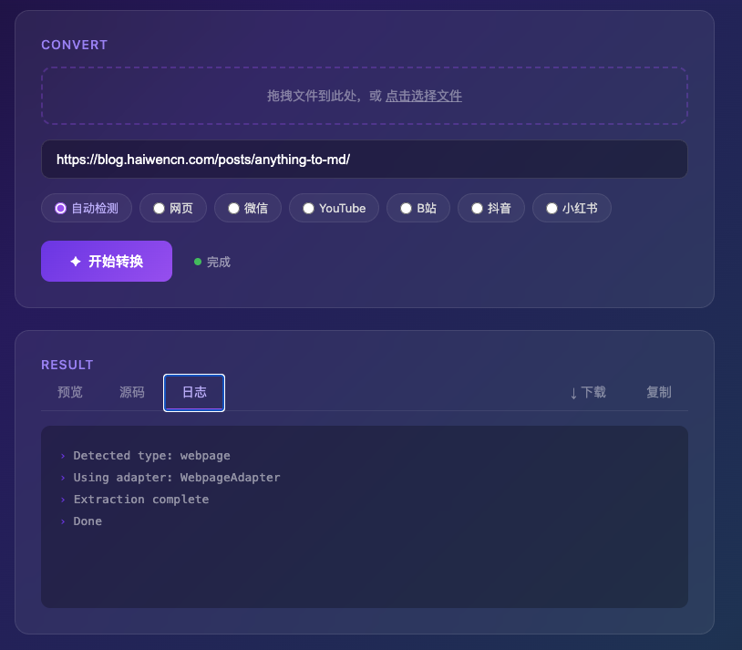
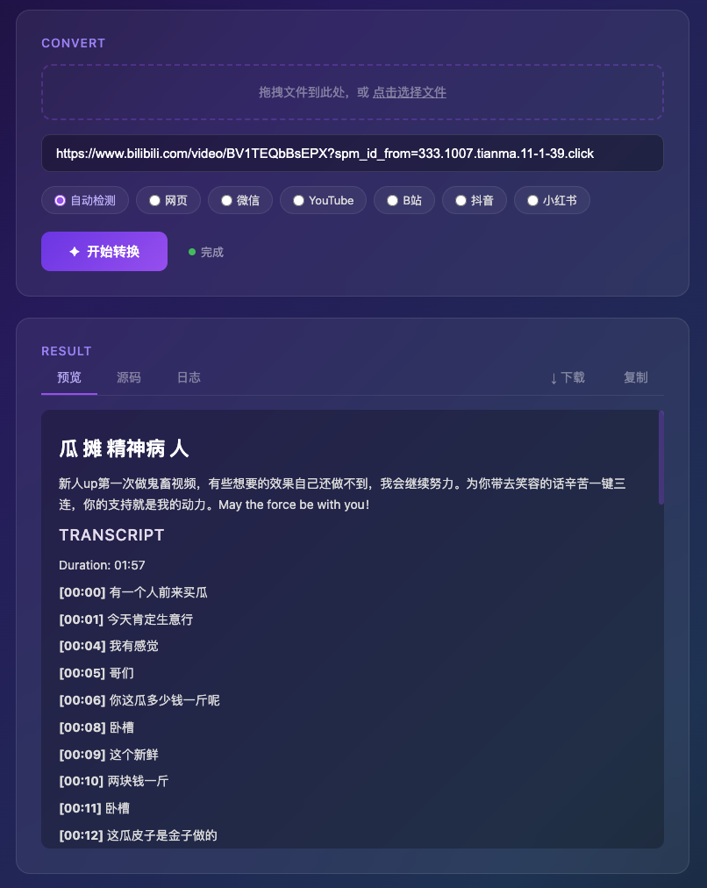
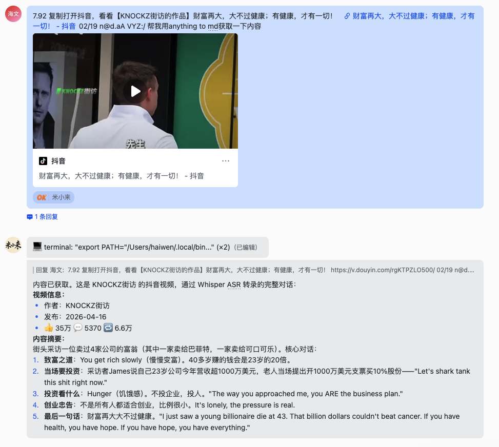

## 一、我想要的很简单

我有一个习惯：看到好的内容就想存下来。不是收藏夹里吃灰的那种，是真的存成 Markdown，放进 Obsidian，能搜索、能引用、能和其他笔记串联。

多平台手动处理成md这是一件极为复杂的事儿，找了半天没找到综合可以直接用的，既然没有现成的，就让我他妈的手搓一个。

## 二、先看结果

在讲技术之前，先看看最终做出来的东西长什么样。

### Web UI

`tomd --serve` 一条命令启动 Web 服务，浏览器自动打开。紫色渐变加玻璃态设计，简单到不需要说明书。


上面是文件拖拽区和 URL 输入框，下面一排平台类型选择——自动检测、网页、微信、YouTube、B站、抖音、小红书。大部分时候你不需要手动选类型，粘贴链接后直接点"开始转换"就行。

### 公众号文章转换

随便找一篇微信公众号文章，粘贴链接，点转换。几秒钟后，完整的 Markdown 就出来了——标题、作者、正文，所有图片都完好无损。



所有图片在转换时就被下载并转成了 base64 直接嵌进 Markdown 文件。这个 .md 文件是完全自包含的，你把它拖到任何地方打开，图片都在。

### 转换日志

切到"日志"标签，可以看到转换过程的每一步：类型检测、适配器选择、内容提取、完成。



这个日志在调试问题的时候特别有用。如果转换失败了，看一眼日志就知道卡在哪一步。

### 视频逐字稿

视频类内容是这个工具最与众不同的地方。粘贴一个 B 站视频链接，它会自动下载音频，用 Whisper ASR 转写成带时间戳的逐字稿。



每一句话都标注了时间戳——`[00:00]`、`[00:01]`、`[00:04]`。你可以全文搜索视频里说了什么，可以引用某一句话并标注时间点。这个想象力应用场景会比较多

### Skill集成

如果你是虾和马等Agent用户，还有更方便的用法。这个工具已经发布为 ClawHub Skill，安装后可以直接在对话里用。



看这个截图：我直接把抖音的分享文本粘贴给hermes——那一大串"7.92 复制打开抖音..."的文字，Claude 自动提取出 URL，调用 `tomd` 转换，几秒钟后返回完整的视频信息和 ASR 转写的对话内容。

这就是我想要的工作流：**看到什么内容，扔给工具，拿回 Markdown。** 不管内容在哪个平台，不管是文字还是视频

好了，结果看完了。下面讲讲这些东西是怎么做出来的。

## 三、多平台技术方案


### 网页：两层防线

通用网页用 [Trafilatura](https://github.com/adbar/trafilatura) 做正文提取，F1 0.958，纯 HTTP 请求，速度快。碰到 JavaScript 渲染的单页应用，加一层 [Crawl4AI](https://github.com/unclecode/crawl4ai) 兜底——Playwright 驱动真实浏览器。先快后稳，覆盖 95% 以上的网页。

踩了个坑：Trafilatura 提取出来的图片变成了 `Image: description` 占位符，URL 丢了。最后从原始 HTML 的 `<article>` 区域提取 `` 标签，按顺序一一替换。不优雅，但管用。

### 微信公众号：

公众号文章本身不难抓，难的是图片。微信给所有图片加了 Referer 防盗链，存下来的 Markdown 过两天全是裂图。

试过伪造 Referer——不稳定。试过镜像站——不可靠。最后的方案：**下载图片，转 base64，直接嵌进 Markdown 文件。** 文件大一些，但永远不会裂图。一个完全自包含的 .md 文件，拖到 U 盘里十年后打开，图片还在。


### 小红书和抖音：数据在 JavaScript 变量里

这两个平台的数据藏在页面的 JavaScript 变量里——小红书是 `window.__INITIAL_STATE__`，抖音是 `window._ROUTER_DATA`。纯 HTTP 请求拿到 HTML，正则提取 JSON，解析出标题、正文、图片 URL、视频流地址。零依赖，不需要 cookie，不需要浏览器。

### YouTube

**第一道关：字幕的视频好办，yt-dlp 可以直接拿。没字幕的，下载音频跑 Whisper ASR。两层自动切换，用户不需要关心。

**第二道关：cookie。** 部分视频不登录访问不了。最终策略是优雅降级——先不带 cookie 试，被拦了自动从 Chrome 读取 cookie 重试。大部分视频不需要登录，需要的时候自动处理。**最大限度降低使用门槛。**

### B站：最省心的一个

B站的 Web API 不需要登录就能拿到元数据和 DASH 音频流。下载音频，Whisper 转写，搞定。唯一要处理的是 URL 里一堆追踪参数（`?spm_id_from=...`），清理掉只保留 BV 号就行。

## 四、ASR：让视频开口说话

视频平台的内容大部分没有文字版。要把视频变成 Markdown，核心是 **ASR（语音转文字）**。

用的是 OpenAI 的 [Whisper](https://github.com/openai/whisper) turbo 模型：

- **开源免费**，本地运行，不需要 API key
- **多语言支持**，中文英文日文都能转
- **带时间戳输出**，每句话标注时间
- brew 安装，CPU 模式运行，4 分钟视频约 1 分钟转写

流程：下载音频 → ffmpeg 提取 → Whisper 转写 → 带时间戳的逐字稿。

后续可以升级到 whisper.cpp（Metal 加速，Apple Silicon 上快 3-5 倍），但目前够用。

## 五、Web UI：不是所有人都爱命令行

CLI 做完了自己用没问题。但有人用还是需要界面。

FastAPI 后端，单文件 HTML 前端（内嵌 CSS/JS，零构建步骤）。`tomd --serve` 一条命令启动，浏览器自动打开。

功能：

- 粘贴 URL 或分享文本，自动识别链接
- 拖拽上传本地文件（PDF、DOCX 等）
- 实时转换日志
- 三种查看模式：预览、源码、日志
- 一键复制 / 下载 .md 文件
- 会话历史记录

所有图片在服务端就转成了 base64 嵌入 Markdown。下载下来的 .md 文件完全自包含，拖到 Obsidian 里直接能看。

## 六、最终的架构

```
输入 (URL / 文件 / 分享文本)
  ↓ 自动识别类型
  ↓ 对应平台适配器提取内容
  ↓ 视频类：字幕优先，无字幕则下载音频 → Whisper ASR 转写
  ↓ 图文类：提取正文 + 下载图片内嵌 base64
  ↓ 组装 Markdown (YAML frontmatter + 正文)
  ↓
输出 .md 文件
```

每个平台一个适配器，各管各的。输出格式统一——YAML frontmatter 带元数据，正文是干净的 Markdown，视频类追加 `## Transcript` 逐字稿。

| 平台 | 方案 | Cookie |
|------|------|--------|
| 网页 | Trafilatura + Crawl4AI | 不需要 |
| 微信公众号 | 直接抓取 + 图片 base64 内嵌 | 不需要 |
| YouTube | yt-dlp + Deno + Whisper ASR | 自动读取 |
| B站 | Web API + DASH 音频 + Whisper ASR | 不需要 |
| 抖音 | iesdouyin 零依赖 + Whisper ASR | 不需要 |
| 小红书 | \_\_INITIAL\_STATE\_\_ 解析 | 不需要 |
| PDF/Office | MarkItDown | - |

## 七、用起来

```bash
# 安装
uv pip install -e ".[all]"
brew install yt-dlp deno ffmpeg openai-whisper

# 命令行
tomd https://example.com/article
tomd "https://www.youtube.com/watch?v=xxxxx"
tomd "https://mp.weixin.qq.com/s/abc123"
tomd ~/Documents/paper.pdf

# Web UI
tomd --serve
```

Linux 和 Windows 也支持——yt-dlp、deno、ffmpeg、whisper 在三个平台都有对应的安装方式。

项目开源在 GitHub：[haiwenai/anything-to-md](https://github.com/haiwenai/anything-to-md)

ClawHub Skill 也已发布，Claude Code 用户可以直接安装：

```bash
clawhub install anything-to-md
```

安装后跟 Claude 说"帮我把这个链接转成 Markdown"，它会自动调 `tomd` 完成转换。

## 八、Anything → MD → Anything 畅想

这个项目解决的是前半段：**Anything → MD**。把散落在各个平台围墙里的内容，变成干净的 Markdown，存进 Obsidian。

但这只是起点。

Obsidian 里的 Markdown 不是终点，是**私有化知识库的原料**。当你积累了几百篇文章、几十个视频逐字稿、几十份 PDF 笔记，这些内容之间开始产生连接——双链、标签、关键词搜索，你的第二大脑慢慢成型。

然后是后半段：**MD → Anything**。

知识库里的内容可以再变成任何形式：

- **MD → 有声书**。上一篇文章里写过的 [pdf-to-audiobook](https://blog.haiwencn.com/posts/agent-voice-clone/)，用你喜欢的声音把文字读给你听。知识库里的任何一篇笔记，都能变成通勤路上的音频。
- **MD → 博客/公众号**。Markdown 天然适合发布。这篇文章本身就是从 Obsidian 里写完直接推到 Hugo 部署的。
- **MD → AI Agent 的记忆**。把知识库喂给你的 Agent，它就有了你积累的所有上下文。你问它一个问题，它能从你三个月前存的一篇公众号文章里找到答案。
- **MD → NotebookLM 播客/摘要**。把 Markdown 扔进 Google NotebookLM，自动生成双人对话播客、摘要、FAQ、时间线。你存下来的每一篇内容，都能变成一期"个人定制播客"。
- **MD → 训练数据**。你精心筛选、整理、标注过的内容，是最高质量的个人数据集。
- **MD → 课件/分享**。攒够了某个主题的笔记，整理一下就是一次分享的素材。

整条链路是这样的：

```
互联网上的任何内容
  ↓ tomd（Anything → MD）
Obsidian 私有化知识库
  ↓ 双链、标签、搜索、积累
第二大脑
  ↓ 输出（MD → Anything）
有声书 / 博客 / Agent 记忆 / 分享 / ...
```

**输入端打通了，输出端打通了，中间是你自己的知识库。** 不依赖任何平台，不受任何围墙限制。内容在你手上，格式由你决定，用途由你定义。

以前看到好的公众号文章：复制全文 → 手动修格式 → 图片裂了 → 算了不存了。以前看到有料的 B 站视频：收藏 → 吃灰 → 视频被删了。

现在：复制链接 → `tomd <链接>` → 十秒钟存进知识库 → 随时检索、引用、再输出。

**心理门槛消失了。** 以前因为"太麻烦"而放弃的内容，现在随手一存。积累多了，连接越来越多，新想法冒出来越来越快。

每个平台都有自己的围墙，每堵墙的砖都不一样。但翻过去之后，所有内容都变成了同一种格式：**干净的 Markdown**。

这才是我想要的知识库的样子。

