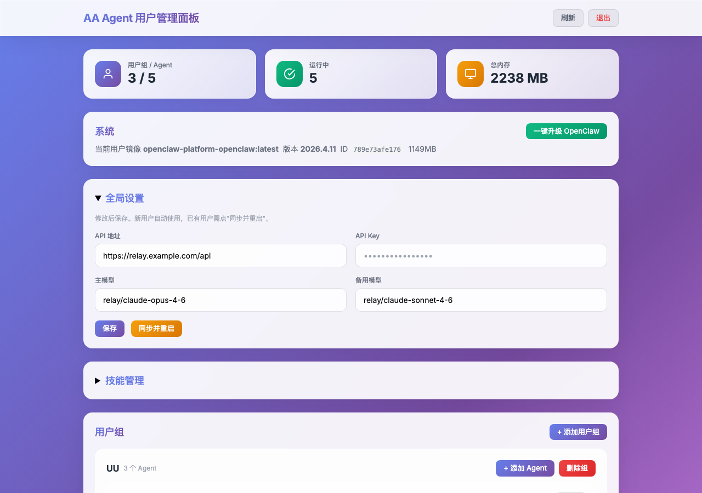
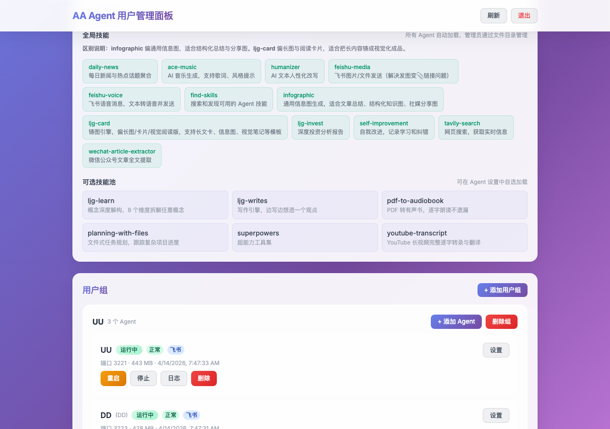
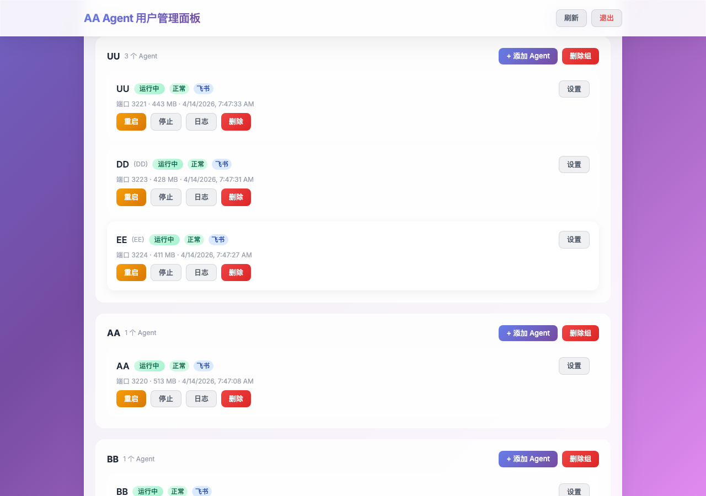

## 一、他们都在用豆包

我身边的朋友，用 AI 的方式基本都一样：打开豆包，问一句，得到一个回答，关掉。

偶尔试试 ChatGPT、Kimi、通义，体验也差不多。**所有人用的是同一个 AI，得到的是同一种回答。**

我想让他们试试不一样的东西。

我自己的 Mac mini 上跑着 [OpenClaw](https://github.com/openclaw/openclaw)——一个开源的 AI Agent 框架。它不是聊天窗口，是一个 24 小时在线的 Agent：能记住你的偏好，能主动跑任务，能调用几十种技能，能读图片、处理文件、搜索网页、生成音频。上一篇写的那个 PDF 转有声书，就是在这上面做的。

用了一段时间，我越来越觉得：**这东西和豆包的差距，不是"好用一点"的问题，是品类不同。**

豆包是搜索引擎的升级版——你问它答。Agent 是一个助手——它知道你是谁、你在做什么、你之前让它干过什么，它能主动做事。

我想让朋友们感受一下这个差距。不是跟他们说"Agent 很牛"——说没用，得自己体验。

问题是：怎么让他们用上？

## 二、"给自己用"和"给别人用"是两件事

我自己的 Agent 跑了很久，配置文件随便写，环境变量到处扔，坏了自己修。但要给朋友用，问题立刻变了：

- 每个人的对话不能混在一起
- 不同人需要不同的 Agent（我要投资分析，朋友要工作助手，家人要生活百科）
- 一个人的 Agent 挂了不能影响别人
- 我不在的时候它得自己跑着，出问题能自动告警
- 朋友不可能来我电脑上改配置文件

一个人用是单机游戏，给一群人用是运维。

## 三、架构：两套系统，完全隔离

我自己的 5 个 Agent（米来、康来、知来、长来、观来）直接跑在 Mac mini 上，原生进程，不走 Docker。这是我的个人工作环境，配置随意改，技能随意装，不受任何约束。

但朋友的 Agent 不能这么搞——万一哪个容器吃光内存或者跑飞了，不能影响我的主力 Agent。所以我单独搭了一套 **OpenClaw Platform**，完全基于 Docker，和我的个人环境物理隔离。

```
Mac mini (24小时运行)
│
├── 我的 Agent（原生进程，不走 Docker）
│   ├── 米来（主 Agent）
│   ├── 康来（健康）
│   ├── 知来（研究）
│   ├── 长来（投资）
│   └── 观来（日报）
│
└── OpenClaw Platform（Docker 容器化，完全独立）
    ├── Admin 管理面板          ── 端口 3211
    ├── 朋友 A / Agent          ── 端口 3220
    ├── 朋友 B / Agent          ── 端口 3221
    ├── 朋友 C / Agent 1        ── 端口 3222
    ├── 朋友 C / Agent 2        ── 端口 3223
    └── ...（最多 50 个）
```

两套系统共享同一个模型中继服务器，但**配置、数据、进程完全不通**。Platform 里的容器挂了、重启了、OOM 了，我这边毫无感知。反过来也一样。

每个朋友是一个"用户组"，下面可以挂多个 Agent。每个 Agent 跑在独立的 Docker 容器里，有自己的飞书机器人、工作目录、对话历史。容器限制 2GB 内存、4GB swap，不会互相抢资源。**隔离是物理层面的——容器级别，不是靠代码里的 if-else。**

实际运行的管理面板长这样：



## 四、飞书：最好的界面是不需要学的界面

为什么选飞书而不是做个网页？

因为再好的网页也要注册登录。飞书他们天天在用，加个联系人就完事了。

在飞书里，每个 Agent 就是一个机器人联系人。打开飞书，找到它，直接发消息——文字、图片、语音都行。不需要知道背后跑着什么模型，不需要知道有 Docker，不需要知道有 API。

**技术上的实现：**

每个 Agent 绑定一个飞书应用（App ID + App Secret）。飞书的消息通过 WebSocket 实时推送到对应的容器，Agent 处理完再通过飞书 API 回复。延迟通常在两三秒以内。

飞书还有一个好处：**天然支持富媒体**。Agent 可以回复 Markdown 卡片、图片、文件，甚至语音消息。比网页版的纯文本对话框强太多。

我给不同的 Agent 配了不同的头像和名字。朋友加完好友之后，完全没有"我在跟一个 AI 说话"的距离感——就像在跟一个朋友聊天。

这一点非常关键。**豆包们的问题不是不够聪明，而是交互方式让人觉得自己在"使用工具"。** 但飞书里的 Agent，感觉是"有个人在帮你"。

## 五、五个 Agent，各管各的

我自己名下有五个 Agent，不是因为贪多，是因为职责需要隔离。

| Agent | 名字 | 干什么 |
|-------|------|--------|
| main | 米来 | 主力 Agent，日常对话、写代码、跑任务 |
| health | 康来 | 健康相关，营养、运动、睡眠数据分析 |
| research | 知来 | 深度研究，长报告、资料整理 |
| invest | 长来 | 投资分析，市场数据、持仓追踪 |
| daily | 观来 | 每日简报，新闻摘要、行业动态 |

为什么不用一个 Agent 干所有事？

试过。问题是 context 会串。你上午让它分析一支股票，下午让它帮你查药物相互作用，晚上让它写代码——对话上下文越来越乱，它开始混淆之前的任务。

拆开之后，每个 Agent 的 system prompt 不同，挂载的技能不同，工作目录也不同。长来只看投资相关的东西，康来只处理健康问题。**专注度是靠隔离实现的。**

而且 Agent 之间可以互相调用。米来发现一个任务需要深度研究，可以把它交给知来，知来做完再把结果传回来。它们之间有一套 Agent-to-Agent 的通信机制。

这就是 Agent 和豆包的本质区别。豆包是一个通才，什么都能聊两句，但什么都不深入。Agent 可以是一个团队——每个成员有自己的专长、自己的记忆、自己的工具箱。

## 六、技能系统：38 个技能，按需加载

OpenClaw 有一套 skill（技能）机制。每个技能是一个独立模块，Agent 按需调用。

我目前装了 38 个技能，分两类：

**全局技能**（所有 Agent 共享）：
- 飞书媒体处理（图片、文件、语音消息）
- AI 文本改写（让 AI 生成的内容更自然）
- 自我改进（Agent 可以修改自己的配置）

**池技能**（按用户组分配）：
- 每日新闻摘要
- YouTube 视频转文字
- 微信公众号文章提取
- PDF 转有声书（上一篇文章写的那个）
- 投资分析套件
- 长文规划与写作

给朋友的 Agent 只挂他需要的技能。做投资的朋友挂投资套件，做内容的朋友挂长文写作，不需要的技能不装——干净、专注。

技能的安装就是往目录里放文件，在管理面板上勾选启用，重启容器生效。社区在 [ClawHub](https://clawhub.com) 上有更多共享技能，缺什么去找就行。

**这也是和豆包的区别。** 豆包的能力是固定的——平台给你什么你用什么。Agent 的能力是可组装的——你需要什么就装什么，没有的可以自己写。上一篇文章里的有声书技能，就是我自己写的。

管理面板里的技能管理界面，全局技能和可选技能池一目了然：



## 七、管理面板：远程运维

给别人用最怕的是出问题了你不知道。

所以我写了一个管理面板（Admin Panel），跑在 3211 端口，浏览器打开就能管理一切：

- **用户组管理**：增删用户组，配置每个用户的 Agent 列表
- **Agent 配置**：改 system prompt、绑定飞书应用、分配技能
- **容器监控**：实时看每个容器的运行状态、CPU、内存
- **一键操作**：启动、停止、重启任意 Agent

每个用户组、每个 Agent 的运行状态一目了然——端口、内存、启动时间、飞书连接状态，全都实时显示：



加了一个自动监控：每隔几分钟检查一次所有容器的状态和飞书连接。如果某个 Agent 挂了或者飞书断连了，监控会通过飞书给我发告警消息。告警有冷却机制，不会每分钟轰炸我一次。

有一次凌晨三点，API 连续超时导致一个容器 OOM 被 Docker 杀掉了。我睡着了，但第二天早上看到飞书有一条告警，重启一下就好了。如果没有监控，我可能几天后才发现朋友那边 Agent 没反应了。

## 八、模型和成本

所有 Agent 共用一个模型配置，通过中继服务器路由：

- **主力模型**：Claude Opus 4.6
- **备用模型**：Claude Sonnet 4.6（Opus 不可用时自动切换）
- API key 集中管理，用户不需要自己申请

有朋友问我：你用的模型和豆包有什么区别？

区别很大。豆包用的是字节自己的云雀模型，能力上限就在那里。我给 Agent 挂的是 Claude Opus——目前综合能力最强的模型之一。同一个问题，回答的深度、准确度、逻辑性差距明显。

成本方面，朋友和家人的使用量其实不大。真正吃 token 的是我自己的五个 Agent——尤其是知来做深度研究和观来跑每日简报的时候。多几个用户的 API 调用量，边际成本很低。

## 九、朋友们的反应

最有意思的不是技术，是人的反应。

第一个用上的朋友，之前是豆包用户。他一开始觉得"不就是换了个 AI 嘛"。用了一周之后说了一句话：**"这个东西像是认识我的。"**

因为 Agent 有持久记忆。你上周让它帮你写的方案，这周它还记得。你告诉过它你的工作背景，以后每次回答都会考虑到这个背景。豆包做不到这一点——每次对话都是从零开始。

另一个朋友让 Agent 帮他整理了三年的读书笔记。他把散落在各处的笔记文件发过去，Agent 按主题归类、提炼关键观点、生成了一份结构化的知识图谱。他说如果自己做大概要一个周末，Agent 二十分钟就搞定了。

家人那边，小朋友最自然。他们发语音问"为什么天空是蓝色的"，Agent 用文字回一段通俗易懂的解释。没人教过他们怎么用，拿起来就聊。

**最好的产品不需要用户手册。**

## 十、踩过的坑

### 坑一：飞书消息去重

飞书偶尔会重复推送同一条消息（网络抖动或者 WebSocket 重连的时候）。如果不做去重，Agent 会对同一个问题回复两遍。

解决方案是在本地维护一个已处理消息 ID 的列表，收到消息先查重再处理。简单但必须有。

### 坑二：容器端口冲突

刚开始手动分配端口，偶尔会撞。后来改成自动分配——从 3220 开始递增，创建新 Agent 时取池里最小的可用端口。

### 坑三：对话历史膨胀

SQLite 数据库存对话历史，跑了几个月后数据库膨胀到了 500 多 MB。倒不影响性能，但备份的时候要注意。后来加了自动压缩和归档机制。

### 坑四：预期管理

这是最难的坑，不是技术问题。

有人会把 Agent 当成全知全能的，完全信任它的每一个回答。也有人会因为 Agent 偶尔出错就觉得"还是不行"。

我的做法是在每个 Agent 的 system prompt 里加了清晰的边界声明。同时也跟朋友说清楚：它是个很强的助手，但不是神。用得好能帮大忙，但别把它的话当圣旨。

**技术能解决的问题都不算问题。人的预期才是真正的问题。**

## 十一、豆包和 Agent 到底差在哪

用了这么久，我觉得差距可以用一句话概括：

**豆包是公共图书馆的管理员——你去问他，他帮你查。Agent 是你的私人助理——他知道你在做什么，主动帮你做。**

具体差在哪：

| | 豆包 / ChatGPT | 专属 Agent |
|---|---|---|
| 记忆 | 每次对话从零开始 | 持久记忆，知道你的历史和偏好 |
| 能力 | 平台给什么用什么 | 技能可组装，缺什么装什么，能自己写 |
| 主动性 | 你问它才答 | 可以定时任务、主动推送、自动执行 |
| 隔离性 | 所有对话混在一起 | 不同职责的 Agent 各管各的 |
| 协作 | 单一对话框 | Agent 之间可以互相调用 |
| 界面 | 专门的 App 或网页 | 嵌入你已有的工具（飞书） |
| 模型 | 平台选的，你没得挑 | 你决定用什么模型 |

不是说豆包不好。对大多数人来说，豆包够用了。但"够用"和"好用"之间有一道巨大的鸿沟。

## 十二、回过头看

最初只是想让朋友试试 Agent，结果搭了一套多用户平台。

但回过头看，这件事的核心不是技术。Docker、端口映射、飞书 API——这些都是手段。核心是一个判断：

**大多数人不是不需要 AI Agent，是没人帮他们把路铺好。**

我朋友不笨。他们在自己的领域都是专家。但你让他们自己搭一个 Agent——申请 API key、配置环境变量、写 system prompt、部署 Docker 容器——他们一步都走不动。

这不是他们的问题。这是整个行业的问题。

现在的 AI 行业像极了 2007 年之前的手机行业——技术已经到了，但产品形态还没找对。豆包们在做的事是"把 AI 装进一个 App"，就像诺基亚在做"更好的功能机"。

而 Agent 的方向是"让 AI 成为你生活的一部分"——不是你去找它，是它在你身边。不是你学会用它，是它适应你。

这个方向对不对，现在还不好说。但我知道一件事：**我朋友用上专属 Agent 之后，再也没打开过豆包。**

---

*写这篇的时候，我打开飞书看了一眼。一个朋友让 Agent 帮他改了一封英文邮件，家里小朋友问了一个关于太阳系的问题，知来正在跑一份行业研究。一台 Mac mini，安安静静跑着，谁也没觉得有什么特别的。*

*最好的基础设施就是这样——你感觉不到它的存在，但它一直在那。*
