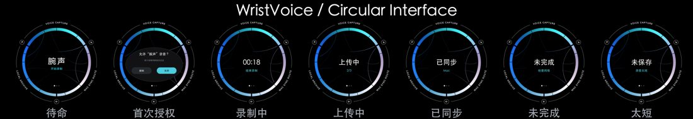
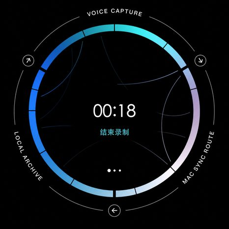
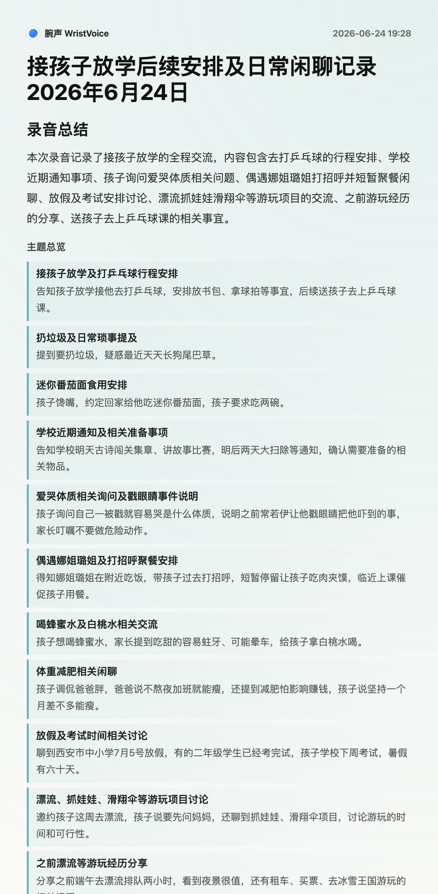
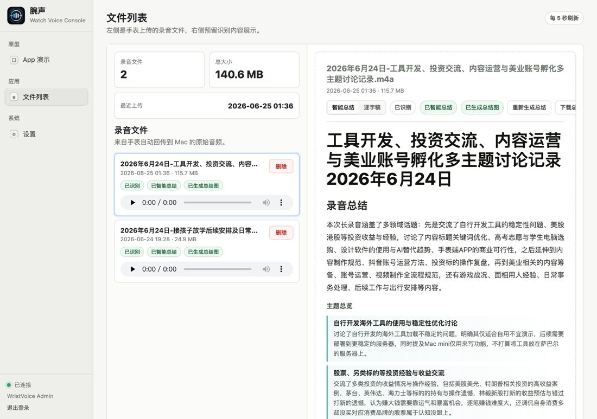
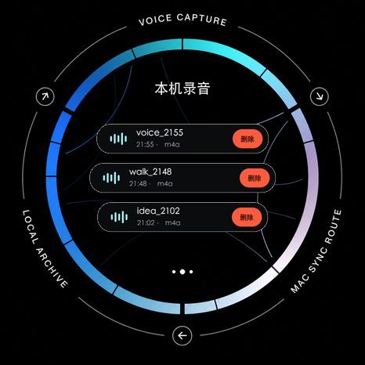

过去半年，为了"把话录下来、让 AI 帮我整理"这一件事，我前后换了三样东西：GET笔记、一张录音卡、一颗录音豆。

它们都很好用。好用到我一度觉得，这事算是解决了。

但每一样，最后都卡在同一个地方——它都是"又一个要带的东西"。

而真正让我舒服下来的那个方案，我一分钱设备钱都没多花。因为它本来就戴在我手腕上。

这篇就讲讲，我是怎么一步步走到"把 AI 录音机戴到手腕上"的，以及我最后做的两套方案。

## 一、先说说那三个我真用过的东西

**第一个是 GET笔记**（现在升级叫"得到大脑"）。它是个手机 App，对着说话，它转写、分段、出智能总结、还能挑出重点和待办。免费版每月给 600 分钟，日常够用。

那段时间我离不开它。开会、走路想事情、听播客，掏出手机按一下就录。它让我第一次实感到：原来"说出来的话"是可以被 AI 自动变成结构化笔记的。

> 📷 *配图：GET笔记 / 得到大脑 App 录音转写界面（来源：[得到大脑官网 biji.com](https://www.biji.com)）*

但它的问题也很直接：它是个 App，意味着**我得掏手机、点开、对准**。在一些场合——比如手上正忙、或者不方便一直举着手机——这个动作就变得别扭。录到一半手机锁屏、来电话、切后台，心里都得惦记着它还在不在录。

**第二个是录音卡。** PLAUD NOTE 这一类，信用卡大小、2.99 毫米厚、30 克，磁吸贴在手机背面，按一下就录，三十小时续航，录完接 AI 出纪要。它把"掏手机点 App"这一步，变成了"按一下卡片"。

> 📷 *配图：PLAUD NOTE 贴在手机背面的样子（来源：[plaud.ai](https://www.plaud.ai)）*

确实更顺手了。但它还是一张要单独带、单独充、单独想着别丢的卡。它解决了"软件不够顺"，没解决"又多一个东西"。

**第三个是录音豆。** 安克和飞书合作的那颗，硬币大小、10 克，可以夹领口、挂脖子，脱离手机也能独立录，录完同步飞书出图文纪要，899 块。

> 📷 *配图：安克 AI 录音豆，硬币大小可夹在领口（来源：[soundcore / 安克创新](https://www.soundcore.com)）*

到这一步，形态已经做到很极致了——又小又轻，几乎无感。我用得很满意。

但你发现没有：从 App 到卡片到豆子，这条线一直在做同一件事——**让那个"要带的东西"越来越小**。

小到极致，它还是一个要带的东西。出门前你还是得想一下："豆子带了吗？充电了吗？夹哪了？"

## 二、那个一直被忽略的设备

有天我跑步回来，低头解表带，忽然卡住了。

我手腕上这块运动手表，我每天醒着的十几个小时几乎都戴着它。它有麦克风，有存储，能联网，能自动同步。

我为了"随身录音"折腾了三个新设备，可**最随身的那个，我从没把它当成录音机看过**。

念头一旦冒出来就收不回去了：录音这件事，最好的载体不是再买一个更小的东西，而是用我**本来就一直戴着**的那个。

录音豆已经做到 10 克无感了。但手腕上的手表是 0 克——因为它的重量我早就付过了。

> 📷 *配图：Apple Watch / 运动手表抬腕的样子（来源：[apple.com](https://www.apple.com/apple-watch/)）*

想清楚这一点之后，我做了两套方案。一套是"用现成的"，一套是"自己搓一个"。

## 三、方案一：用现成的，Apple Watch + iCloud

如果你不想写一行代码，这套就够用了。

思路很简单，全程不碰手机：

1. **手表直接录**。Apple Watch 自带录音，抬腕、点一下就开始，是手表上最自然的动作，比掏手机顺太多。
2. **自动进 iCloud**。录音落到 iCloud，手机、电脑那头自动就有了，不用导、不用传。
3. **AI 接一刀**。在电脑那端挂一个自动流程，新录音一进来就转写、总结，按"总结 / 话题 / 待办"理好。
4. **结果再回 iCloud**。把整理好的总结、甚至生成的总结图，丢回 iCloud。于是手机相册或文件里，随时能翻。

它的好处是**零开发**，全是现成件拼的：手表负责录，iCloud 负责同步，AI 负责整理。你只要把这几段接起来。

代价是它"散"——同步、转写、总结是三段分开的东西，整条链不是一个完整产品，偶尔要你手动推一把。但对大多数人，这套已经够爽了。

我想要更"一体"一点，所以有了第二套。

## 四、方案二：自己搓一个，WristVoice

WristVoice 是我自己做的手表录音 App（Wear OS）。目标只有一句话：**对着手表说完话，过几分钟，一份整理好的总结自己就在那等我了**，中间我什么都不用管。

它长这样——一块表，从待命、录音、上传到文件管理，整套状态都在手腕上走完：

录音就是抬腕点一下，中心那个波形动起来就是在录，再点一下停。没有掏手机，没有解锁，没有找 App。

录完之后，后面这一长串全是自动的，我列一下它到底在干嘛：

- **手表录完自动上传**。走我自己的一台 Mac（套了 Cloudflare 隧道），大文件分块传、断了自动重试，传不上就先留在"待上传"里，不丢。
- **先压小再识别**。Mac 这边先把音频转成 16k 单声道的小文件，再发给豆包做语音识别——又快又省，识别精度不受影响。
- **大模型整理成五块**。豆包把逐字稿整理成固定结构：**录音总结、话题、金句、待办、相关链接**。话题不是一句话糊弄，是把这段真聊了什么、聊出什么结论，一条条铺开。
- **生成一张能直接发的总结图**。

最后出来的就是这么一张卡片——这是真实一条录音（接孩子放学路上的一段闲聊）跑出来的：

我在电脑上还有个后台，所有录音、逐字稿、总结、总结图都在这看，点开哪条看哪条：

待上传、已上传、识别中、已总结，每条录音走到哪一步，一眼就知道：

说实话，做这套东西，难点根本不在"录音"。录音谁都会。难在后面那一长串没人看见的活：手表怎么稳稳把文件传出去、断网怎么续、几万字的逐字稿怎么让模型既快又不糊弄地总结、总结怎么排成一张好看的图。

这些做完，体验才变成那一句话：**我对着手表说完，几分钟后总结在那等我。**

## 五、最后想说的

回头看这半年，从 GET笔记到录音卡到录音豆，我其实一直在为同一个需求买单：让"记录"这件事更无感。

厂商把硬件越做越小，已经做到极致了。但**真正的那一步，不是再小一点，而是换个想法**——不再额外带一个东西，而是把能力塞进我本来就在用的那个。

而能让我把这个想法真的"跑起来"的，是 AI。

放在两年前，"我希望我的手表能自动录音、自动总结、自动给我出一张图"——这种话也就是想想。要凑一个团队，要写一堆代码，要排很久。想想就算了。

现在不一样了。一个普通人，不等产品经理、不等供应链，一个人就能把脑子里那个"要是……就好了"，变成手腕上真在跑的东西。

那种感觉，不是省了多少钱。是**"这玩意儿我居然真的做出来了"**。

AI 最让我上瘾的，从来不是它替我干了多少活。是它把"我也能做到"这件事，还给了每一个普通人。

你手腕上、口袋里，是不是也有个"要是它能帮我做 X 就好了"的念头？

也许，它没你想的那么远。
