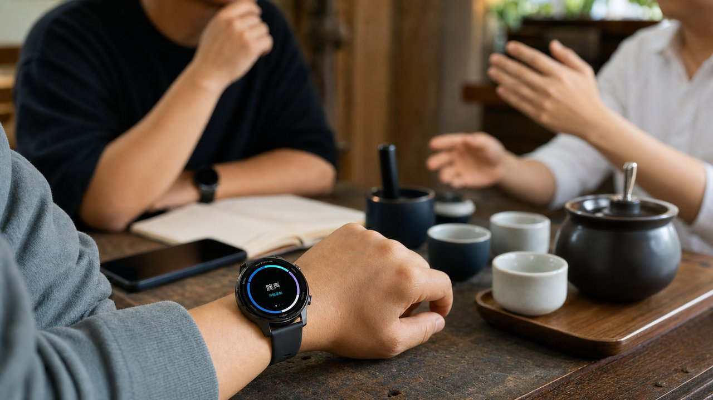
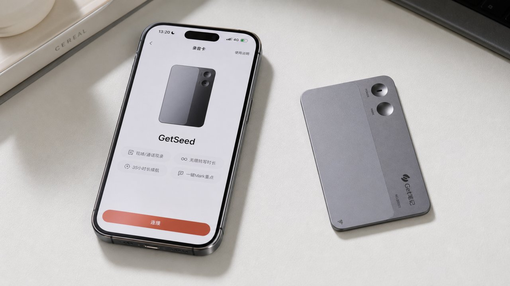
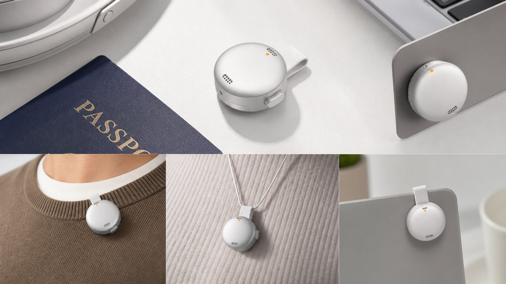
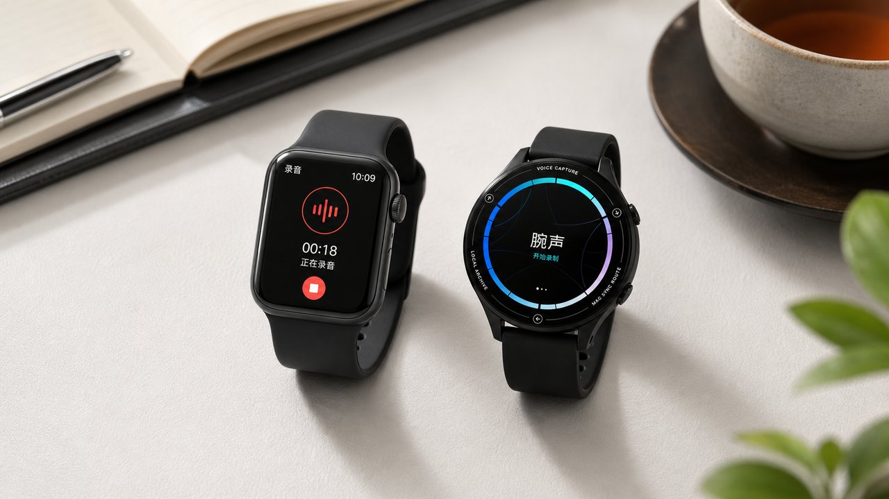
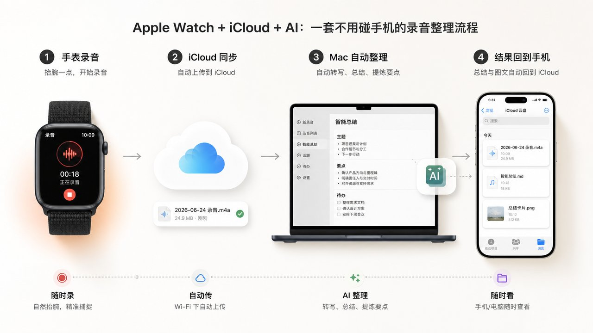
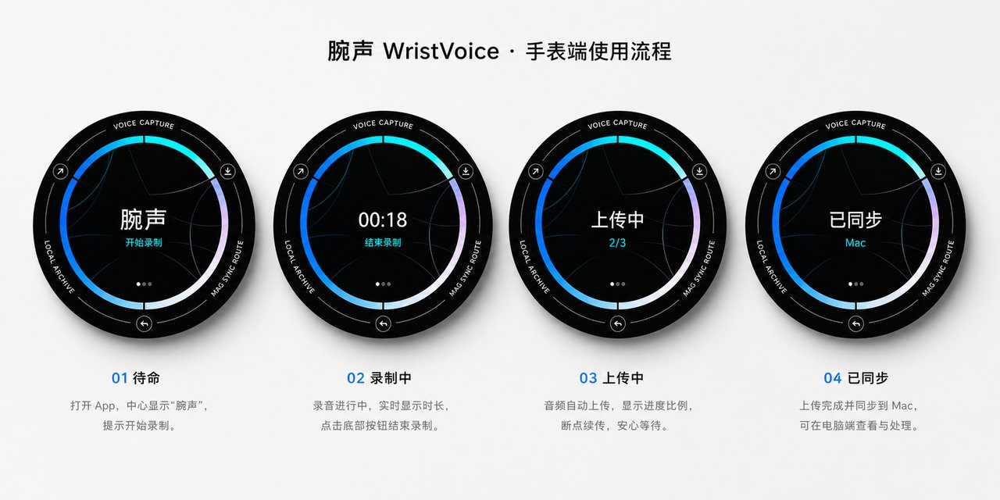
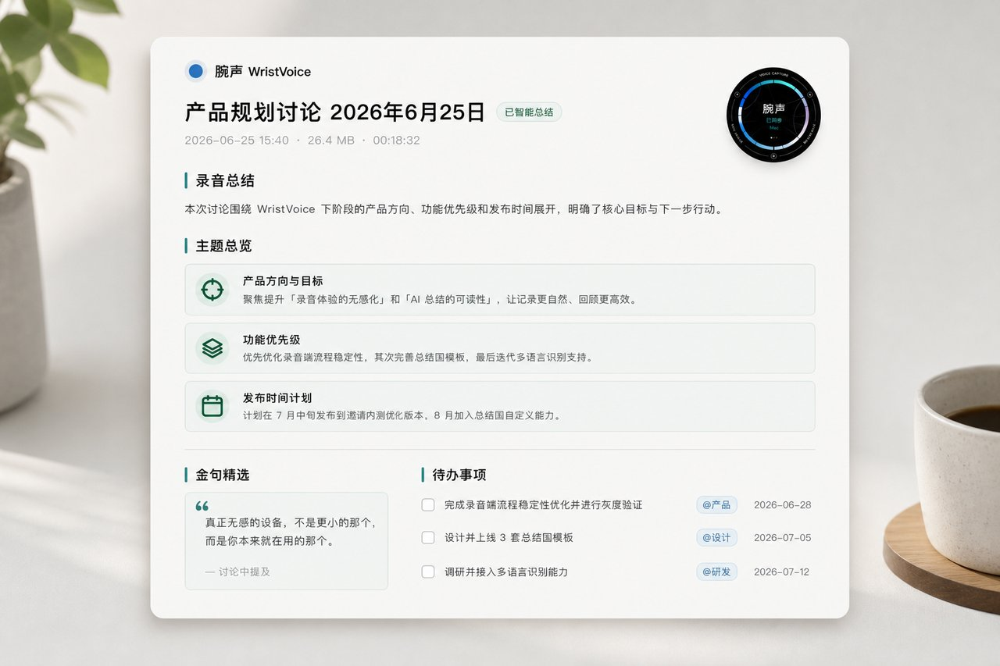
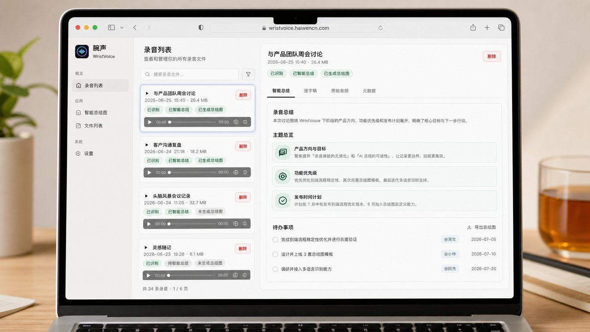

过去半年，我一直在折腾同一件事：把我和别人之间那些真实的交流——喝茶、聊天、开会、谈事情——录下来，让 AI 帮我整理成事后能翻、能查、能继续用的东西。

后来，有些日子我甚至会开着 AI 录音录一整天。晚上让它给我出一份「日总结报告」：今天见了谁、聊了什么、谈成了什么、留下哪些待办。

这些一天天零散的对话攒起来，其实是一份挺值钱的数据。

为了把这件事做顺，我先用了 GET 笔记的 AI 录音卡，又换成安克的录音豆，一路都在折腾同一个问题：怎么让「随时录、随手就有」更无感。

它们都很好用。好用到我一度觉得，这事算是解决了。

但每一样，最后都卡在同一个地方：它都是「又一个要带的东西」。

而真正让我舒服下来的那个方案，我一分钱设备钱都没多花。因为它本来就戴在我手腕上。

## 一、先说说我真用过的那几样

### 1. GET 笔记 AI 录音卡：把录音入口贴到手机背面

第一个是 GET 笔记的 AI 录音卡。信用卡大小，2.99 毫米厚，30 克，磁吸贴在手机背面，按一下就录，30 小时续航；录完接 AI，直接出转写、分段、智能总结，还能挑出重点和待办。

它把「掏手机、点开 App、对准」这一连串动作，压成了「在手机背面按一下卡片」。

那段时间我是真离不开它。和人喝茶谈事情，按一下；开个会，按一下；后来甚至想试着录一整天，看看一天聊下来 AI 能替我理出点什么。

但用久了，别扭的地方很具体：它终究是一张要单独带、单独充、单独惦记着别丢的卡。

而且录完，我还得掏出手机、打开 App、等它把录音传过去。哪怕传输速度已经很快，这一步也一点都不「无感」。

它解决了「软件不够顺」，但没解决「又多一个东西」。

### 2. 安克录音豆：把额外设备做到更小

第二个是安克的录音豆。硬币大小，10 克，可以夹领口、挂脖子，脱离手机也能独立录，录完同步出图文纪要。

形态已经做到很极致了：又小又轻，夹上几乎忘了它的存在。我用得很满意。

但你发现没有：从手机 App，到贴手机的卡，再到夹领口的豆，这条线一直在做同一件事——让那个「要带的东西」越做越小。

小到极致，它还是一个要带的东西。出门前你照样得过一遍：「豆子带了吗？充电了吗？夹哪件衣服上了？」

## 二、那个一直被我忽略的设备

转机来得很偶然。和朋友闲聊，聊到「怎么佩戴才能既无感又好看」，话题绕到了手表、戒指上。我脑子忽然「叮」了一下：这不就是同一件事吗？

而在 AI 的加持下，把它落地，好像并不难。

我手腕上这块运动手表，我每天醒着的十几个小时几乎都戴着它。它有麦克风，有存储，能联网，能自动同步。

我为了「随身录音」折腾了一圈新设备，可最随身的那个，我从没把它当成录音机看过。

录音豆已经做到 10 克无感了。但手腕上的手表，对我来说是 0 克——因为它的重量我早就付过了。

想清楚这一点，我做了两套方案：一套「用现成的」，一套「自己搓一个」。

## 三、方案一：用现成的，Apple Watch + iCloud

如果你不想写一行代码，这套就够用了。思路很简单，全程不碰手机：

1. 手表直接录：抬腕、点一下就开始，这是手表上最自然的动作。
2. 自动进 iCloud：录音落到 iCloud，手机、电脑那头自动就有了，不用导、不用传。
3. AI 接一刀：电脑端挂个自动流程，新录音一进来就转写、总结，按总结、话题、待办理好。
4. 结果回 iCloud：把总结，甚至总结图丢回 iCloud，手机里随时能翻。

它的好处是零开发，全是现成件拼的。

我之所以还想要第二套，是因为我更想要「持久」一点。尤其我常常要开着录一整天，对续航更挑剔。我的运动手表待机更长，戴着的频率也比 Apple Watch 高。

既然每天戴的是它，我干脆把整套能力直接做进它里面。

## 四、方案二：自己搓一个，WristVoice

WristVoice 是我自己做的手表录音 App，跑在我的运动手表上。

目标只有一句话：对着手表说完话，过几分钟，一份整理好的总结自己就在那等我，中间我什么都不用管。

录音就是抬腕点一下，再点一下停。没有掏手机，没有解锁，没有找 App——这正是录音豆、录音卡都给不了我的那一下「无感」。

停下之后，后面这一长串全是自动的：

- 手表录完自动上传到我家里的一台 Mac。大文件分块传，断网先留在「待上传」，不丢。
- Mac 先把音频压小，再送进大模型识别，又快又省，精度也不掉。
- 大模型把逐字稿整理成录音总结、话题、金句、待办、相关链接。话题不是「聊了相关事宜」这种糊弄话，而是把真聊了什么、聊出什么结论一条条铺开，不压缩。
- 最后生成一张能直接发出去的总结图。

我在电脑上还留了个后台，所有录音、逐字稿、总结、总结图都能在这里看。

说实话，第一版能跑起来很快；真正花时间的是把它跑稳。

录音这一下并不难，难的是后面那些没人看见的脏活：文件怎么稳稳传出去、断网怎么不丢、几十分钟甚至几小时的逐字稿怎么既快又不糊弄地总结出来。

有 AI 在旁边，我不用等团队、等供应链，也不用先把每个细节都想完。边做边试，几个小时就把它变成了一套能用的流程。

跑起来之后，场景全打开了。

和人喝茶聊一下午，喝茶结束了，脉络已经在等我；见了一整天人、开了一整天会，晚上让它揉成一份「日总结报告」；那些原本聊完就散、再也不会点开的对话，第一次变成了能攒下来、能回头查的东西。

## 五、最后想说的

回头看这半年，从 GET 笔记的录音卡，再到安克录音豆，我一直在为同一个需求买单：让「记录」更无感。

厂商把硬件越做越小，已经到极致了。但真正的那一步，不是再小一点，而是换个想法：不再额外带一个东西，而是把能力塞进我本来就在用的那个东西里。

而能让我把这个想法真的跑起来的，是 AI。

放在两年前，「我希望我的手表能自动录音、自动总结、自动出图」也就是想想。现在不一样了：一个普通人，不等团队、不等供应链，一个人就能把脑子里那个「要是……就好了」变成手腕上真在跑的东西。

那种感觉不是省了多少钱，是「这玩意儿我居然真做出来了」。

AI 最让我上瘾的，从来不是它替我干了多少活，而是它把「我也能做到」还给了每一个人。

AI让普通人感觉自己无所不能。

如果你也已经习惯用 AI 录音，别急着买下一个更小的硬件。

先看看你手腕上的那块表。

它可能就是最无感的录音入口。把它接上 AI，你每天散落在聊天、会议、茶桌里的信息，就能自动变成可以回看的资料。
