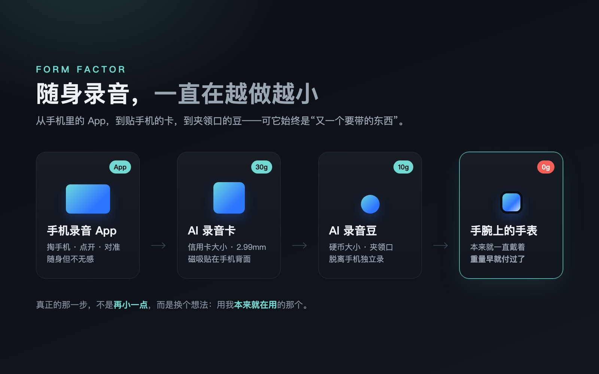
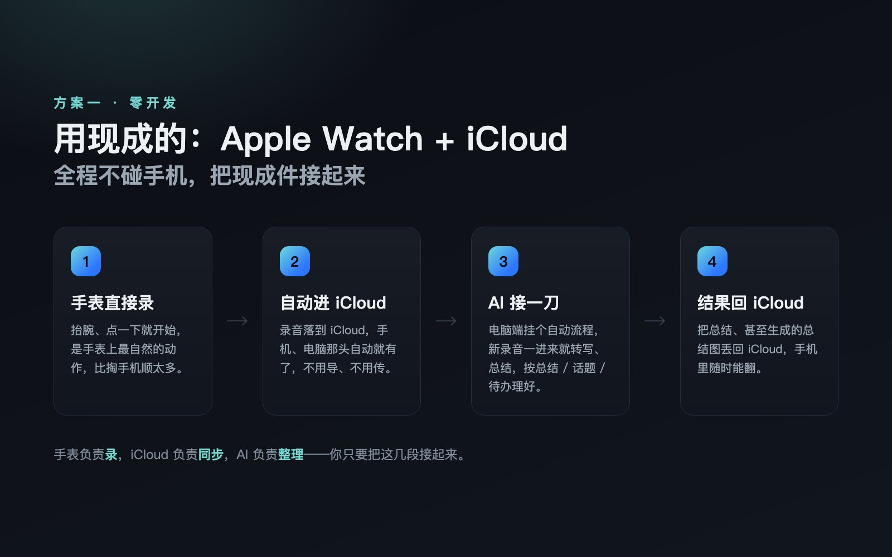
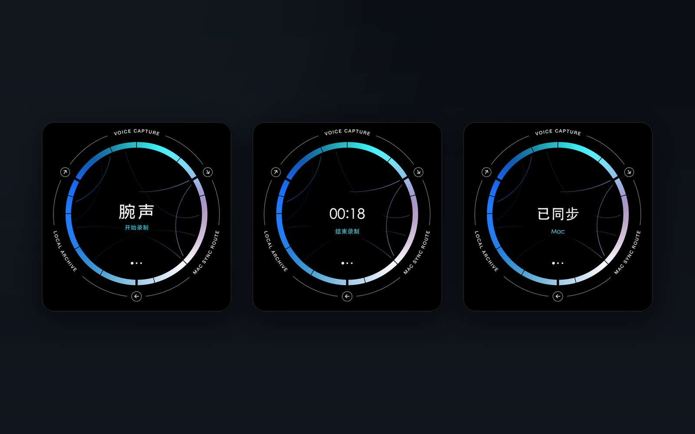
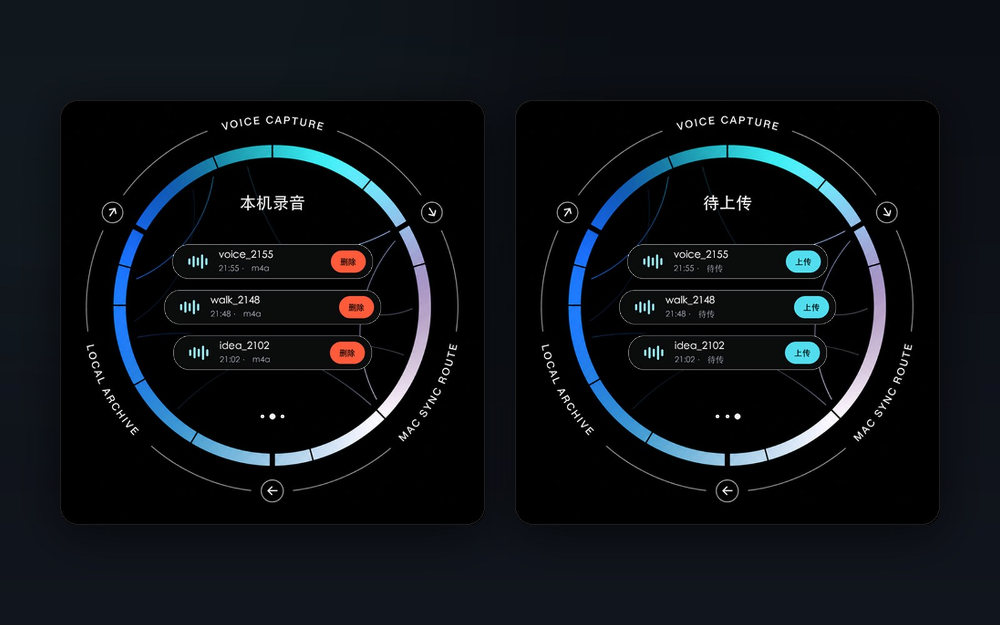
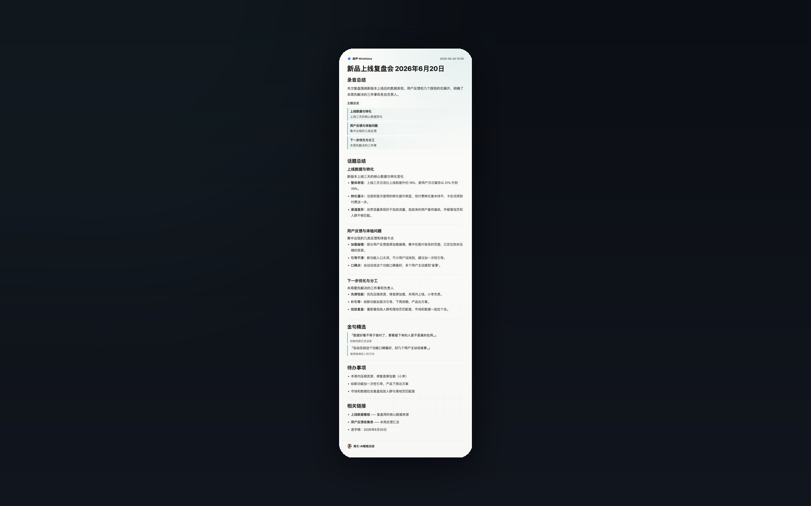
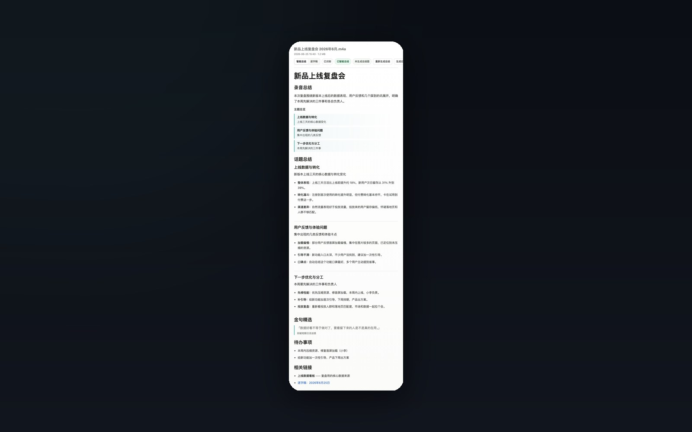

过去半年，我干了一件有点上头的事：为了把脑子里冒出来的话第一时间录下来、让 AI 帮我整理，我前后换了好几样设备。

灵感这东西不挑时间。开车等红灯的时候、跑完步喘着气的时候、和朋友聊到一半突然想通一件事的时候、哄完孩子瘫在沙发上的时候——想说的那句话，往往就在那几十秒里，错过就忘。

所以这半年，我先用 GET笔记 的 AI 录音卡，又换成安克的录音豆，一路在折腾同一件事：怎么让「随手录一段」更无感、更顺手。

它们都很好用。好用到我一度觉得，这事算是解决了。

但每一样，最后都卡在同一个地方——它都是「又一个要带的东西」。

而真正让我舒服下来的那个方案，我一分钱设备钱都没多花。因为它本来就戴在我手腕上。

这篇就讲讲，我是怎么一步步把 AI 录音机「戴」到手腕上的，以及我最后做的两套方案。

## 一、先说说我真用过的那几样

**第一个是 GET笔记 的 AI 录音卡。** 信用卡大小、2.99 毫米厚、30 克，磁吸贴在手机背面，按一下就录，三十小时续航；录完接 AI，直接出转写、分段、智能总结，还能挑出重点和待办。它把「掏手机、点开 App、对准」这一连串动作，压缩成了「在手机背面按一下卡片」。

那段时间我是真离不开它。开会按一下，走路想事情按一下，听播客想记两句也按一下。它让我第一次实感到：原来「说出来的话」是可以被 AI 自动变成结构化笔记的——我负责开口，它负责整理。

但用久了，别扭的地方也很具体：它终究是一张要**单独带、单独充、单独惦记着别丢**的卡。而且录完，我还得**掏出手机、打开 App、等它把录音传过去**——哪怕有高速传输，这一步也一点都不「无感」。它解决了「软件不够顺」，但没解决「又多一个东西」。

**第二个是安克的录音豆。** 硬币大小、10 克，可以夹领口、挂脖子，脱离手机也能独立录，录完同步出图文纪要。形态已经做到很极致了——又小又轻，夹上几乎忘了它的存在。采访、开会、边走边说，它都比掏卡更自然。我用得很满意。

但你发现没有：从手机 App，到贴手机的卡，再到夹领口的豆，这条线一直在做**同一件事——让那个「要带的东西」越做越小**。

小到极致，它还是一个要带的东西。出门前你照样得在心里过一遍：「豆子带了吗？充电了吗？昨天夹哪件衣服上了？」

## 二、那个一直被我忽略的设备

转机来得很偶然。有次和朋友闲聊，聊到「怎么佩戴才能既无感又好看」，话题绕到了手表、戒指这类东西上。我脑子忽然「叮」了一下：这不本质是同一件事吗——而在 AI 的加持下，把它落地，好像并不是一件多难的事。

我手腕上这块运动手表，我每天醒着的十几个小时几乎都戴着它。它有麦克风，有存储，能联网，能自动同步。

我为了「随身录音」折腾了一圈新设备，可**最随身的那个，我从没把它当成录音机看过**。

念头一旦冒出来就收不回去了：录音这件事，最好的载体不是再买一个更小的东西，而是用我**本来就一直戴着**的那个。

录音豆已经做到 10 克无感了。但手腕上的手表，对我来说是 0 克——因为它的重量，我早就付过了。

想清楚这一点，我做了两套方案：一套是「用现成的」，一套是「自己搓一个」。

## 三、方案一：用现成的，Apple Watch + iCloud

如果你不想写一行代码，这套就够用了。思路很简单，全程不碰手机：

1. **手表直接录。** Apple Watch 自带录音，抬腕、点一下就开始，是手表上最自然的动作，比掏手机顺太多。
2. **自动进 iCloud。** 录音落到 iCloud，手机、电脑那头自动就有了，不用导、不用传。
3. **AI 接一刀。** 在电脑那端挂一个自动流程，新录音一进来就转写、总结，按「总结 / 话题 / 待办」理好。
4. **结果回 iCloud。** 把整理好的总结、甚至生成的总结图，丢回 iCloud。于是手机相册或文件里，随时能翻。

它的好处是**零开发**，全是现成件拼的：手表负责录，iCloud 负责同步，AI 负责整理，你只要把这几段接起来。

我之所以还想要第二套，是因为我更想要「持久」一点。我的运动手表待机时间更长，平时戴着的频率也比 Apple Watch 高——既然每天戴的是它，我干脆把整套能力，直接做进它里面。

## 四、方案二：自己搓一个，WristVoice

WristVoice 是我自己做的手表录音 App，跑在我的运动手表（Wear OS）上。目标只有一句话：**对着手表说完话，过几分钟，一份整理好的总结自己就在那等我了**，中间我什么都不用管。

先看它长什么样——一块表，从待命、录音到「已同步 Mac」，整套状态都在手腕上走完：

录音就是抬腕点一下，中间那圈波形动起来就是在录，再点一下停。没有掏手机，没有解锁，没有找 App——这正是录音豆、录音卡都给不了我的那一下「无感」。

往左滑还能管理本地录音：哪些已经传上去了、哪些还在「待上传」等网络，都在手腕上一目了然，断网漏传的那条不会被悄悄吃掉。

停下之后，后面这一长串，全是自动的。我把它在背后干的事拆开说说：

- **手表录完，自己往外传。** 文件自动上传到我家里的一台 Mac。大文件会分块传、断了自动续，要是临时没网，就先乖乖躺在「待上传」里，等有网了再补，绝不悄悄丢。
- **先压小，再识别。** Mac 这边先把音频转成体积小很多的格式，再送进大模型做语音识别——又快又省，识别精度还不掉。
- **大模型把逐字稿理成五块。** 录音总结、话题、金句、待办、相关链接。这里我花了最多心思：话题不能是「聊了相关事宜」这种糊弄话，而是把这一段**真聊了什么、聊出了什么结论**，一条条铺开；该丰满的地方丰满，不许压缩成一句话。
- **最后生成一张能直接发出去的总结图。**

比如随手录的一次复盘会，出来就是这样一张卡片，干干净净，存下来或转手发给同事都行：

我在电脑上还留了个后台，所有录音、逐字稿、总结、总结图都在这看，点开哪条看哪条，每条走到「识别中 / 已总结 / 已出图」哪一步，一眼就知道：

说句实话，做这套东西，难的从来不是「录音」——录音谁都会。难的是后面那些没人看见的脏活：手表怎么稳稳把文件传出去、断网怎么不丢、几万字的逐字稿怎么让模型既快又不糊弄地总结成五块、总结怎么排成一张拿得出手的图。

而这些，放在两年前我是不敢碰的。可现在，有 AI 一路陪着我把这些坑一个个填平，我一个人、几个周末，居然就真的让它跑起来了。

跑起来之后，使用场景一下子全打开了：

- 开完一个会，下楼的路上总结已经在手机里等我了，不用回去对着录音再听一遍；
- 走路时想通一个事，抬手说两句，等于给未来的自己存了一张「想法卡」；
- 和家人、朋友难得的一段长聊，事后能留下一份干净的脉络，而不是一段再也不会点开的音频。

它们的共同点是：我**只需要开口，剩下的交给手腕**。

## 五、最后想说的

回头看这半年，从 GET笔记 到录音卡到录音豆，我其实一直在为同一个需求买单：让「记录」这件事更无感。

厂商把硬件越做越小，已经做到极致了。但**真正的那一步，不是再小一点，而是换个想法**——不再额外带一个东西，而是把能力，塞进我本来就在用的那个。

而能让我把这个想法真的「跑起来」的，是 AI。

放在两年前，「我希望我的手表能自动录音、自动总结、自动给我出一张图」——这种话也就是想想。要凑一个团队，要写一堆代码，要排很久。想想也就算了。

现在不一样了。一个普通人，不等产品经理、不等供应链，一个人就能把脑子里那个「要是……就好了」，变成手腕上真在跑的东西。

那种感觉，不是省了多少钱。是**「这玩意儿我居然真的把它做出来了」**。

AI 最让我上瘾的，从来不是它替我干了多少活。是它把「我也能做到」这件事，重新还给了每一个普通人。

你手腕上、口袋里，是不是也有个「要是它能帮我做 X 就好了」的念头？

也许，它没你想的那么远。
