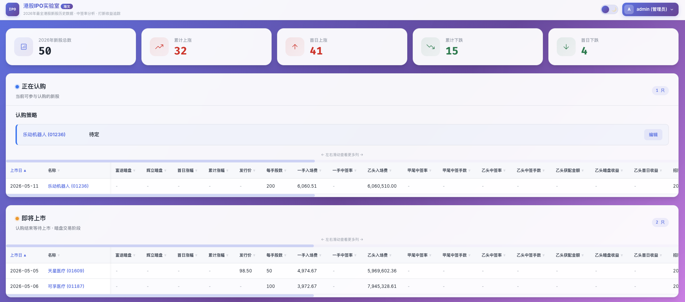
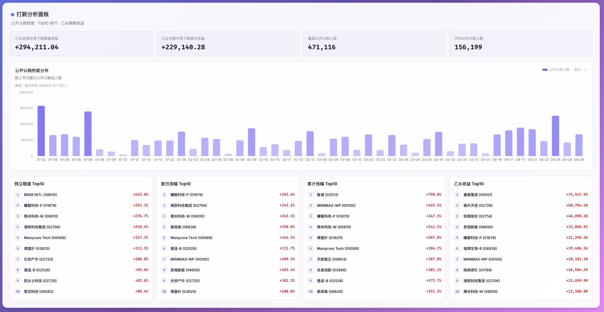
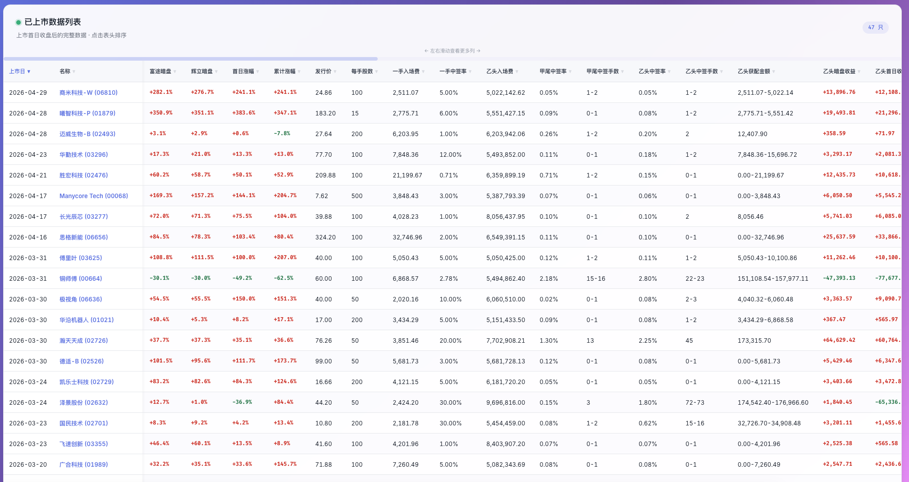

港股打新又开始有人聊了。

这件事对老打新人来说并不陌生。港股新股市场一旦有赚钱效应，讨论会很快回来：哪只正在招股，哪只超购很高，暗盘涨了多少，首日会不会破发，乙头到底值不值得上。

也正因为这样，它很容易吸引一些完全没准备好的人进来。

举个虚构的负面例子。

小明本来只是看到群里有人说港股打新又赚钱了，心里一热，匆忙去开了港股账户，先充了 1 万港币进去试试。结果打了几只，一只没中。

他开始觉得问题不在自己，而在“方法不对”。于是到处找老师，进群，听课，看别人晒收益。老师告诉他，一手不中很正常，资金太少没意思，要提高中签率，最好上乙组。

小明越听越觉得有道理。

后来他刷了借款，把钱转进去，兴冲冲打了一只热门新股的乙组。结果这只新股配得不少，暗盘却直接破发。分配多，亏得也多。最后所谓的打新赚钱，变成了搬砖还债。

这个例子听起来夸张，但它说明一个很简单的问题：热度本身不是判断。

但真开始看数据的时候，麻烦也很快回来。

一只新股，不只是“打”或者“不打”这么简单。

你要看招股价、入场费、每手股数、认购日期、上市日。还要看一手中签率、甲尾中签率、乙头中签率、公开认购人数、超购倍数、回拨比例、绿鞋、基石投资者。

上市前要看暗盘。

上市后要看首日涨幅。

如果想复盘，还要看累计涨幅、乙头收益、历史 Top10。

这些数据每个都能找到。

问题是，它们不在一个地方。

所以我做了一个港股 IPO Radar。

名字听起来像雷达，本质上是一个港股打新数据平台。网站已经跑起来了：[ipo.haiwencn.com](https://ipo.haiwencn.com/)。

它不是自动荐股，也不是让 AI 告诉我哪只可以买。它要做的事更具体：把港股新股从招股、配发、暗盘、首日到后续表现，整理成一个可以持续看的系统。

这个项目的第一版，是我用 Agent 一下午搓出来的。

## 以前我想要的，不是一张新股表

如果只是看“有哪些新股”，一张表就够了。

但港股打新真正有价值的数据，不在“有哪几只”这里，而在后面那一串细节里。

比如乙头。

普通人看新股，可能先看一手入场费和一手中签率。但对高阶一点的打新人来说，乙头收益更重要。

一只新股如果暗盘涨了 20%，看起来不错；但你到底能不能赚到钱，还要看乙头入场费、乙头中签率、乙头获配手数。最后算出来的，不是一个涨幅，而是一笔钱。

所以我的表里不是只放“涨了多少”。

它要能看到富途暗盘、辉立暗盘、首日涨幅、累计涨幅、一手中签率、甲尾中签率、乙头中签率、乙头获配金额、乙头暗盘收益、乙头首日收益。

这就不是普通新股日历了。

它更像一个打新复盘表：每只新股从招股到上市之后，市场到底给了什么结果，都要留在里面。



## 真正麻烦的不是页面，而是数据口径

这个项目真正麻烦的地方，不是前端页面。

前端当然也要做。现在页面里有三块：正在认购、即将上市、已上市数据列表。顶部还有 2026 年新股总数、累计上涨、首日上涨、累计下跌、首日下跌这些汇总。

但这些只是看得见的部分。

更重的是数据。

港股 IPO 的很多关键字段，不能靠人手填，也不能让 LLM 随便补。招股书里有每手股数、入场费、B 组头、招股价、认购期、上市日、板块、市值、基石、A+H、稳价人。

配发结果里有发行价、一手中签率、甲尾中签率、乙头中签率、公开认购人数、乙组人数、超购倍数、国际配售倍数、回拨、绿鞋、公开募资、公开认购总额。

这些字段如果错了，页面做得再漂亮也没用。

所以这个项目里有几条专门的脚本：

`01_discover_and_download.py` 负责发现新股、搜索 HKEX、下载招股书和配发结果 PDF。

`02_parse_prospectus.py` 负责解析招股书。

`03_parse_allotment.py` 负责解析配发结果。

还有一个 `audit_pdf_parsing.py`，专门用来审计 PDF 解析结果和数据库是不是对得上。

这里面有一个细节我很在意：配发结果解析脚本已经对当前 47 只有配发结果 PDF 的股票做过全量校验，脚本解析值可以稳定复现数据库结果。

这说明它不是一个“AI 大概看一下”的东西。

它是一个要讲数据口径的系统。

## 一下午搓出来，重点不是快

如果让我自己从零做这个项目，以前大概率会拖很久。

不是因为我不知道要做什么。

恰恰相反，是因为我知道得太多了。

我知道要有新股发现，要有 PDF 下载，要有招股书解析，要有配发结果解析，要有 SQLite 数据库，要有前端表格，要有分析面板，要有定时任务，还要部署到线上。

知道得越多，越容易不开始。

因为你会自动在脑子里把项目拆成一堆麻烦事：字段怎么设计，数据源怎么选，PDF 解析规则怎么补，前端表格怎么横向展示，暗盘和首日行情怎么同步，服务器怎么跑。

这次我没有先写一份很完整的方案。

我直接让 Agent 先做。

先把能跑的版本搭出来。先有页面，先有数据结构，先有脚本，先有 API，先让前后端通起来。

跑起来之后，再一项项补。

这就是 Agent 对我最大的帮助：它没有替我想明白所有事情，但它把“想法”推到了“可以修改的系统”那里。

以前这种项目，我可能想三天，最后还是放着。

现在是一下午先搓出来。

跑起来再说。

## 这个项目特别的地方，是把打新的几个阶段串起来

港股打新不是一个瞬间动作。

它其实有几个阶段。

招股前，你要知道有哪些新股来了。

招股中，你要看入场费、招股价、行业、保荐人、稳价人、基石投资者。

认购结束后，你要等配发结果，看一手、甲尾、乙头中签率，看公开认购人数和超购倍数。

上市前，你要看暗盘。

上市后，你要看首日涨幅。

再往后，你还要看累计表现，复盘这只新股到底只是赚了一天，还是后面继续涨。

IPO Radar 做的不是某一个点。

它把这些阶段串到了一张系统里。

后端定时任务也按这个节奏跑：每小时发现新股、补招股书、查配发结果；晚上 19 点、20 点、21 点同步暗盘；19:05、20:05、21:05 补首日数据；20:10 同步已上市股票累计涨幅；21:00 同步 HKEX HSIC 行业。

这就有点像一个自动值班的人。

它不替我判断市场，但它会在该看的时间点去看。

## 为什么这比手工整理强很多

手工整理不是不行。

如果只看一两只新股，手工当然可以。

但只要你想持续看，问题就来了。

今天一只，明天两只，下周又来几只。每一只都要查招股书、查配发、查暗盘、查首日。字段一多，表格很快就乱。口径一乱，后面复盘就没有意义。

比如乙头收益。

如果只是看涨幅，你会错过很多东西。

一只新股暗盘涨幅高，不代表乙头一定赚得多。还要看入场费和获配手数。反过来，有些涨幅看起来一般，但如果获配结构不同，实际收益也可能不一样。

所以系统里要直接算：

```text
乙头暗盘收益 = 入场费 × 乙头中签手数 × 辉立暗盘涨幅
乙头首日收益 = 入场费 × 乙头中签手数 × 首日涨幅
```

这类东西靠手工每次算，也不是不能算。

但你算几次就烦了。

更重要的是，手工算出来的数据，很难沉淀成历史排行榜。系统做出来以后，Top10、公开认购人数趋势、乙头全打收益这些东西就可以一直累积。



图里最有意思的不是某一个数字。

而是这些数字开始进入同一个体系。

比如公开认购人数分布，可以看市场热度；辉立暗盘 Top10、首日涨幅 Top10、累计涨幅 Top10，可以看不同阶段的赚钱效应；乙头收益 Top10，则更接近打新人真正关心的钱。

这就是它和普通“新股助手”的区别。

它不是临时帮我看一只。

它是在积累一套自己的打新数据库。

## 已上市数据，才是这个系统的沉淀部分

打新最容易只看眼前。

今天哪只热，明天哪只涨，后天哪只破发。

但如果只看眼前，很多判断都会变成情绪。

我更想要的是把每只已经上市的新股留下来。它上市日是什么时候，暗盘涨多少，首日涨多少，累计涨多少，一手中签率多少，乙头实际收益多少。

这些数据一旦沉淀下来，后面才有复盘的基础。



这张表里可以看到一个很真实的东西：有些新股暗盘、首日、累计表现都很好；也有些新股首日表现和后续累计表现并不一致。

港股打新不是只看一眼涨幅。

你要看这只新股在不同阶段的表现，也要看同一批新股之间的横向差异。

这件事靠记忆是不可靠的。

靠群里截图也不可靠。

最终还是要靠一张持续更新的表。

## 它不是自动荐股，这个边界要守住

我一直不想把这个项目写成“AI 帮我打新赚钱”。

这个说法很容易传播，但不准确。

港股打新有机会，也有风险。赚钱效应回来了，不等于每只新股都会涨。超购高，不等于上市不破发。暗盘涨，也不等于首日还能涨。

所以这个系统不应该替人做决定。

它应该做的是把信息整理好，把数据口径统一，把历史表现留下来，把那些原本分散的信息放到一个地方。

最后要不要打，还是人自己判断。

这也是我觉得 Agent 比较适合的位置。

它不是替我做那个最后的判断。

它是把判断前面的准备工作，尽量自动化。

## 对我来说，这个项目的意义不只是港股打新

港股 IPO Radar 当然是一个具体项目。

它解决的是港股打新的数据问题。

但做完以后，我更强烈地感受到另一件事：现在一个人做垂直工具的门槛，真的变低了。

过去这种系统，一个人想做，很容易死在开始之前。

你知道它有用。你也知道大概要怎么做。但一想到数据、脚本、前端、后端、部署、定时任务、字段校验，就会自动把它放进“以后再说”。

Agent 改变的是这个地方。

它不保证你一下午做出完美产品。

但它可以让你一下午做出一个能跑的第一版。

第一版跑起来以后，事情就变了。

你可以对着真实页面改字段，可以看着真实数据补规则，可以发现哪个指标没用，哪个指标应该提前。

你从“我想做一个东西”，变成“我在改一个已经存在的系统”。

这个状态差别很大。

## 先跑起来，再慢慢变准

IPO Radar 现在还不是终点。

Web 端主体已经能用，后面重点应该是继续稳定数据自动化，完善运营口径，再做微信小程序。

小程序会更适合高频查看：正在认购、即将上市、排行榜、打新日历、提醒、收藏、分享卡片。

Web 端则更适合全量数据、横向对比、管理员维护和历史复盘。

但不管后面怎么改，第一版跑起来这件事已经完成了。

对我来说，这就是 Agent 做个人项目最实际的价值。

它不是给我一个漂亮的想象。

它把一个本来太重、太散、太容易拖延的想法，先变成了一个能打开、能看数据、能继续迭代的系统。

港股打新又热了。

我正好需要一个自己的新股数据平台。

以前这事自己搞太难了。

现在就先让 Agent 搓出来。

跑起来，再说。
